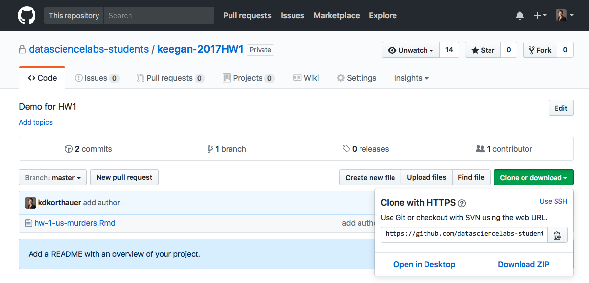
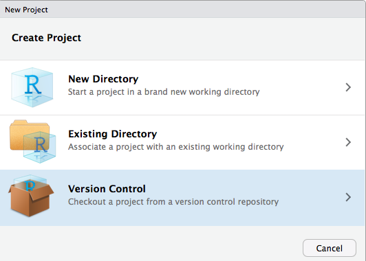
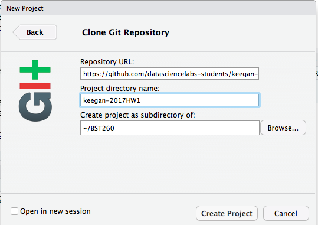
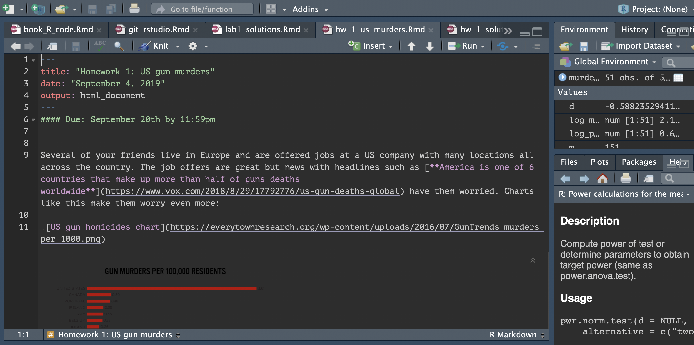
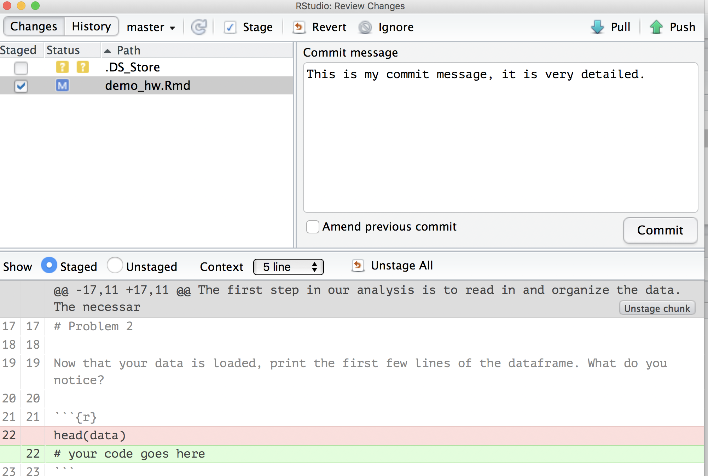

## Submitting Homework on GitHub
We will first practice how to pull, work on and submit your homework on github. We have set up a  homework #0 repo for you. Go to the [datasciencelabs-student github page](https://github.com/datasciencelabs-students) and look for a repository named `<your GitHub username>-2022HW0`. Click on the repository and follow the next steps below.


1. Copy the link near the top of the page that is revealed after clicking 'clone or download'.

 <center></center>

2. In RStudio, start a new project: 

> File > New Project > Version Control > Git

<center></center>

In the "repository URL" paste the URL of the homework repository you just copied. Take charge of – or at least notice! – the local directory for the Project. A common rookie mistake is to have no idea where you are saving files or what your working directory is. Pay attention. Be intentional. Personally, I suggest you check “Open in new session” and to keep all your homework repositories in a 'BST260' folder.

<center></center>

3. Click "Create Project". You should now see the files in the repository in the lower right window in RStudio. Also notice the Git tab in the upper right window.

 <center></center>


### Working on your homework

Once you have a local copy of your repository, it's time to get to work! 

Using code presented in class, answer the first question. When you are finished, `knit` the file. 

You have updated the file on your personal machine, but not the file on your github repository. To do this, click the `commit` button in the Git tab window. This is equivalent to `save` in most programs. But what is special about `git` and other version control software is that we can track 
and revert changes!

Now write a `commit message`, which will help you keep track of the changes we made when you look at this in the future. Leave detailed messages so that future you will know what you did. Future you will thank you.

 <center></center>

You can now `push` your work to Github by clicking the *green up-arrow* in the Git tab window. If you are asked for username and password, provide them. If they are not recognized, you likely need to setup a token in GitHub and you need to enter it into R Studio. There are instructions on how to do that at the end of this section. Note, you can (and should) do this as many times as you want before the homework deadline. What is great about this is that it will make getting help from your TA easier as well as keeping a copy of your work in the cloud in case your computer crashes, or you accidentally delete something.	Also note that committing your work without pushing it will not update the file in your repository. So always remember to push!

To check that the push was successful, refresh your github repo page, click on your homework file and see if the file was updated. You can also look at the `last commit` column to see when your files were last updated.


### Setting up a token in GitHub and linking it to R Studio
GitHub has great instructions on how to create a token at this link: https://docs.github.com/en/authentication/keeping-your-account-and-data-secure/creating-a-personal-access-token. 
Make sure you save your token in a secure place where you can find it again. Your token expires after a certain amount of time that you specify when you set it up. I recommend having your token stay valid for at least three months. GitHub will email you when it is time to update your token. 

Once you have your token, you will need to tell R Studio what it is. If it is the first time you have provided a token to R Studio, you will need to install the *gitcreds* package and do the following: 

```{r eval = FALSE}
library(gitcreds)
gitcreds_set()
```
It may give you the option to enter in the token, or the following questions will pop-up

```{r eval = FALSE}
1: Keep these credentials
2: Replace these credentials
3: See the password / token

```

Select option 2. You will be able to enter in your token. At that point R Studio should be able to push and pull from GitHub. 

### Summary
To summarize, it is important to do the following 
steps whenever you finish working on your homework to make full 
use of `git` and Github as well as generally having the best 
experience in this class. 

1. Work on your homework
2. Commit changes to your local repository: `commit` button in Git tab in RStudio
3. Push the changes to your github repo: `push` (green arrow) button in Git tab in RStudio

Generally keep this picture in mind whenever you want to do this 
loop, it is important to only add changed files you care about 
and nothing you do not care about. If certain files keep popping 
up in your git status that you will never want to add, e.g. `.Rhistory`, 
etc, add them to your `.gitignore` to simplify your life, this will keep 
those files from showing up here. For more info on this see the 
`version_control.Rmd`


